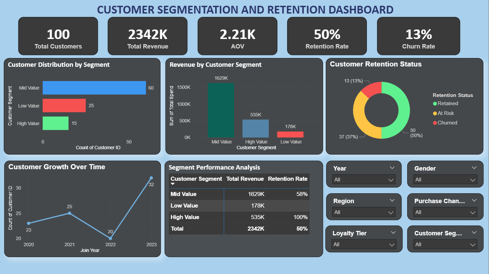

# customer-segmentation-retention-powerbi
Power BI dashboard analyzing customer segmentation, retention, churn, and revenue insights for data-driven decision making.

🚀 Project Overview

This project focuses on analyzing customer behavior, segmentation, and retention using Power BI. It helps identify high-value customers, churn risks, and revenue-driving segments.

🎯 Objective

* Understand customer segments
* Analyze retention and churn patterns
* Identify high-value customers
* Enable data-driven decision-making

🛠 Tools Used

* Power BI
* Excel
* DAX
* Power Query

📂 Dataset Description

The dataset includes:

* Customer demographics
* Purchase behavior
* Engagement & satisfaction scores
* Retention status
* Customer segmentation & loyalty tiers

⚙️ Key DAX Measures

* Total Customers
* Total Revenue
* Average Order Value (AOV)
* Retention Rate (%)
* Churn Rate (%)
* Customer Lifetime Value (CLV)

📊 Dashboard Features

* KPI Cards for quick insights
* Customer segmentation analysis
* Retention vs churn breakdown
* Revenue analysis by segment
* Interactive filters (Region, Gender, Channel, Loyalty Tier)

🔍 Key Insights

* High-value customers contribute the majority of revenue
* At-risk customers require targeted retention strategies
* App channel shows higher engagement
* Platinum tier customers are most profitable

🖼 Dashboard Preview

📌 Conclusion

This dashboard enables businesses to improve customer retention, optimize marketing strategies, and maximize profitability using data-driven insights.
